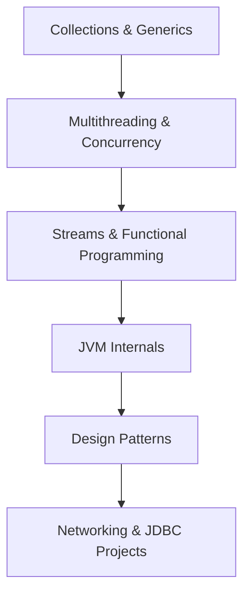

## **_ java advance _**

# ⚡ Java Advanced – Unlock the Full Power of Java

<p align="center">


</p>

<p align="center">
💡 A one-stop repository to **master advanced Java** concepts with <br> 🚀 hands-on examples, 🧩 design patterns, ⚙️ JVM internals, and 🔥 real-world use cases.
</p>
---

## 🌟 Why This Repository?

Java is **more than just OOP**. To build scalable, secure, and performant applications, you need to understand the **advanced features**.
This repo is designed as a **learning roadmap + reference guide** to take you from **intermediate → expert** in Java.

---

## 📚 Topics You’ll Master

✅ **Collections Framework** → Lists, Sets, Maps, Queues, Iterators, Concurrent Collections
✅ **Generics** → Type Safety, Wildcards, Bounded Types
✅ **Multithreading & Concurrency** → Executors, Synchronization, Locks, Semaphores
✅ **Streams & Functional Programming** → Lambdas, Filters, Map-Reduce, Method References
✅ **JVM Internals** → Class Loaders, Garbage Collection, JIT Compiler, Memory Model
✅ **Design Patterns** → Creational, Structural, Behavioral Patterns
✅ **File Handling & Serialization** → Read/Write, Object Streams
✅ **Networking** → TCP/UDP Sockets, HTTP Clients, REST APIs
✅ **JDBC & Databases** → CRUD, Transactions, Connection Pooling

---

## 🗂️ Repository Structure

```bash
📦 Advance-java-code
 ┣ 📂 collections       # Lists, Sets, Maps, etc.
 ┣ 📂 generics          # Wildcards, Bounds
 ┣ 📂 multithreading    # Threads, Executors
 ┣ 📂 streams           # Functional Programming
 ┣ 📂 design-patterns   # GoF Patterns in Java
 ┣ 📂 networking        # Socket & HTTP examples
 ┣ 📂 jdbc              # DB connectivity examples
 ┣ 📂 extras            # File I/O, Serialization
 ┗ 📜 README.md
```

---

## 🚀 Quick Start

```bash
# Clone the repo
git clone https://github.com/Shubhu1134/Advance-java-code.git

# Navigate to the folder
cd Advance-java-code

# Compile and run any example
javac path/to/FileName.java
java FileName
```

💡 Use an IDE like **IntelliJ IDEA** or **Eclipse** for the best experience.

---

## 🧭 Learning Roadmap



---

## 🤝 How to Contribute

We welcome contributions of all forms 🙌

1. Fork the repo 🍴
2. Create a feature branch 🌱
3. Commit changes ✍️
4. Open a Pull Request 🚀

---

## 🎯 Vision

By the end of this journey, you will:
✨ Write **clean, production-grade Java code**
✨ Understand the **JVM at its core**
✨ Apply **design patterns like a pro**
✨ Build **real-world projects** with networking & database layers

---

## 🛠️ Tech Stack

- **Language** → Java 17+
- **Build Tools** → Maven / Gradle
- **IDE** → IntelliJ IDEA / Eclipse / VS Code
- **Database** → MySQL, H2 (for JDBC demos)

---

<p align="center">
  🚀 Ready to master Java? <br>
  ⭐ Star this repo & begin your journey today!  
</p>

---
